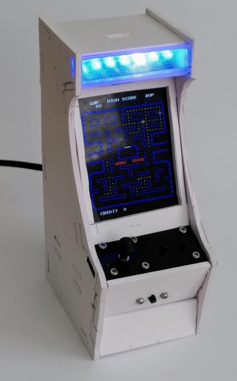
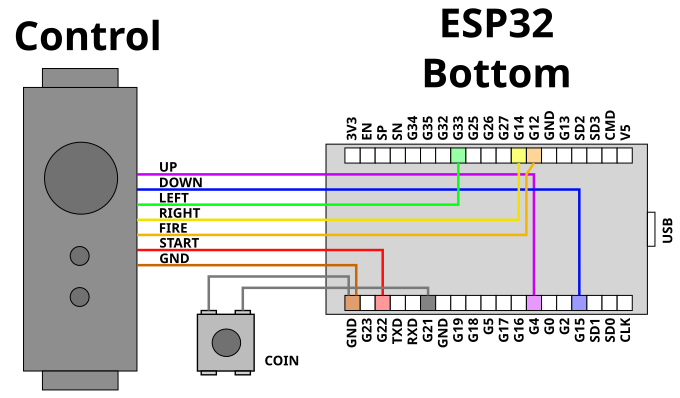
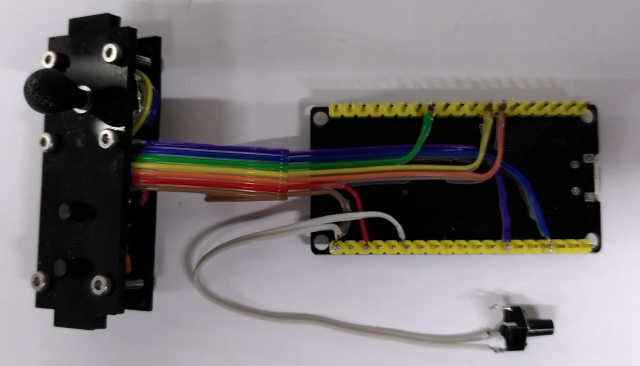
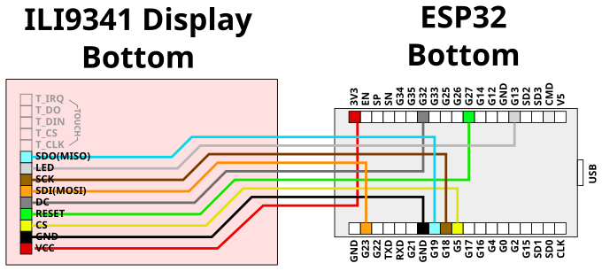
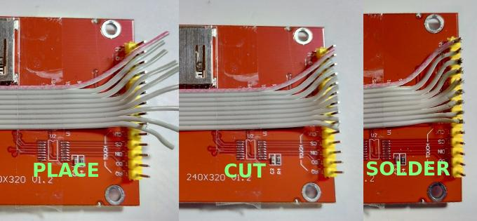
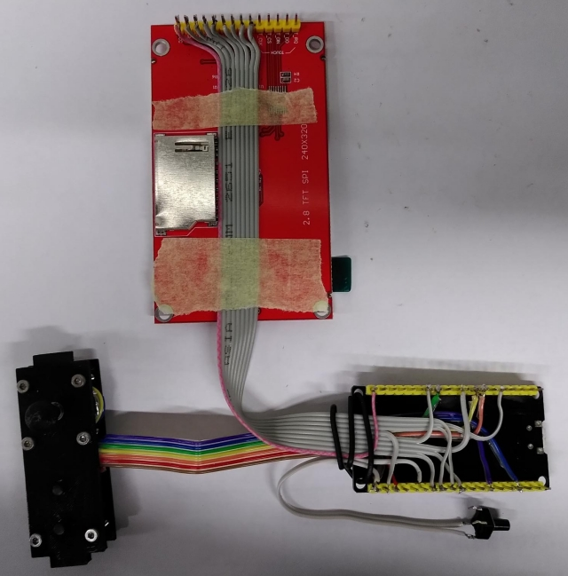
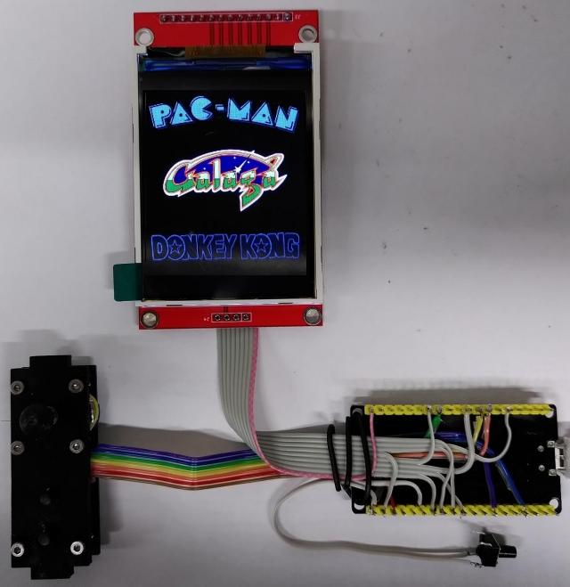
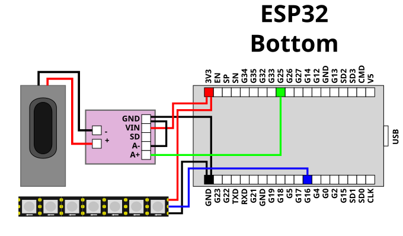
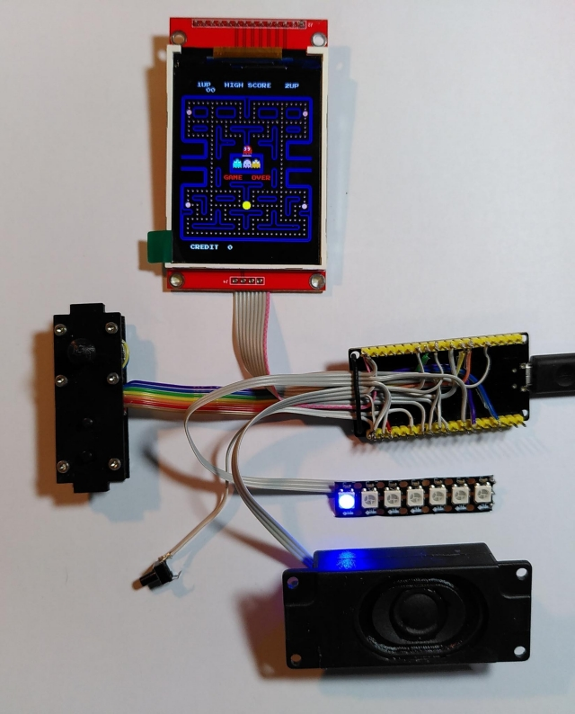
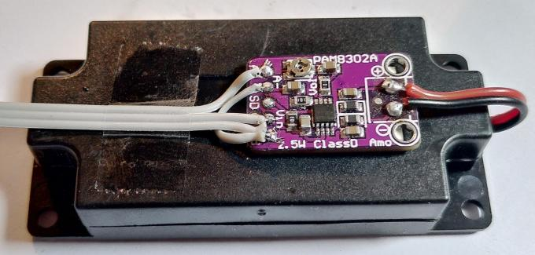

# Hardware Assembly

If the hardware is to be placed inside a tiny arcade like
the one depicted below, then it needs to be assembled more
compact than the breadboard allows.

[Video](https://youtube.com/shorts/vverV4NphlQ)

## Wiring 

Wiring takes place in a certain order and arrangement in order
to be able to place the result nicely inside the cabinet.

### Buttons

First are the buttons have to be connected. These need to be wired
first as they are located right beside the ESP32 board and their wires
would interfere with the display wiring afterwards.

[PDF](wire_control.pdf)

This step connects the [controlboard](../controlboard/) and the
[coin button](../coinbutton) to the ESP32 board. You can solder the wires
directly to the ESP32 board or use female pin headers if you want to
be able to easily replace the ESP32.

### Display

The next to wire up is the display.

[PDF](wire_display.pdf)

Arranging all wires in a neat way makes the soldering much easier
and robust and will later ease assembly.

The displays connections are placed on top of the control wires so the
display can later be mounted directly above the controls.

The display is mounted 180° rotated compared to the breadboard setup.
This can be adjusted for in the [config.h](../../galagino/config.h) file.

The setup should be working at this point:

Finally the speaker and the optional LED stripe are attached. Each of
them requires only three wires:

[PDF](wire_audio_led.pdf)

The final assembly should then look like this:

The amplifier board cannot be seen as it's taped to the back of the speaker
compartment using double sided tape.

