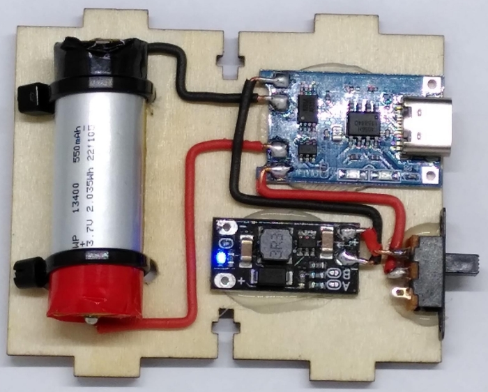
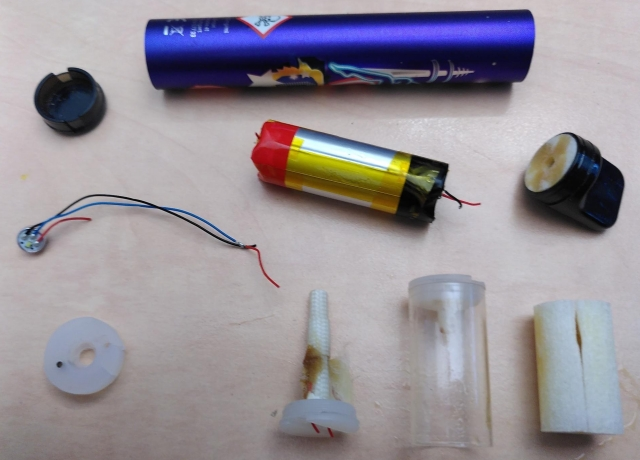

# Battery powered Galagino

The Galagino by default runs from USB power supply. The cabinet
has some empty space at its very bottom which can be used to
mount a battery incl. charger and 5V supply. The parts can
be mounted to [part 8 of the cabinet](../cabinbet). 

The battery in this example has been take from a Vape. Although
these are designed to be disposable they contain rechargeable
batteries which can be re-used in projects like this. The one
depicted above is a 550 mAh battery from a vape. These can
be disassembled rather easily and besides the strong sweet smell
these are easy to use.

Only few parts are needed besides the battery itself.

  - A charger board (e.g. powered via USB)
  - A battery protection circuit
  - A DC/DC converter generating 5V from the battery voltage

Various cheap charger boards contain some or all of these parts.
The setup depicted above uses the two board. The top one
combines a USB charger with the battery protection circuit.
The smaller PCB at the bottom is a DC/DC converter generating
5V from the batteries 3.7V.

A toggle switch mounted between the battery and the DC/DC
converter allows to turn the device on and off. The 5V are
then fed into the 5V input of the ESP32 board.
