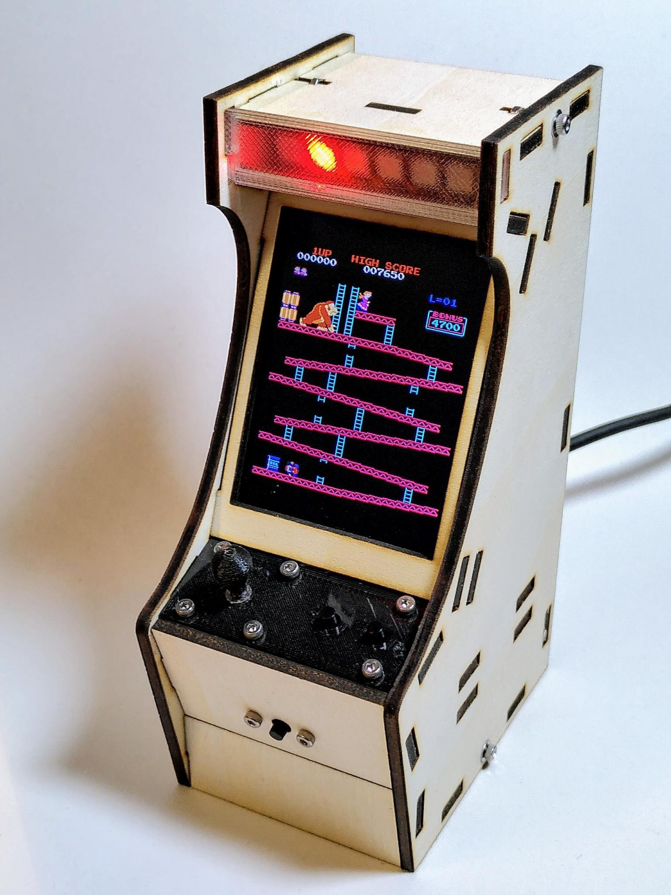
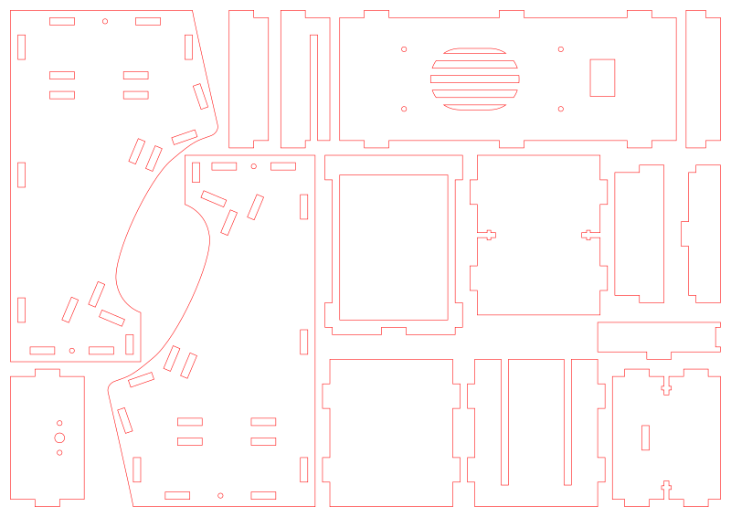
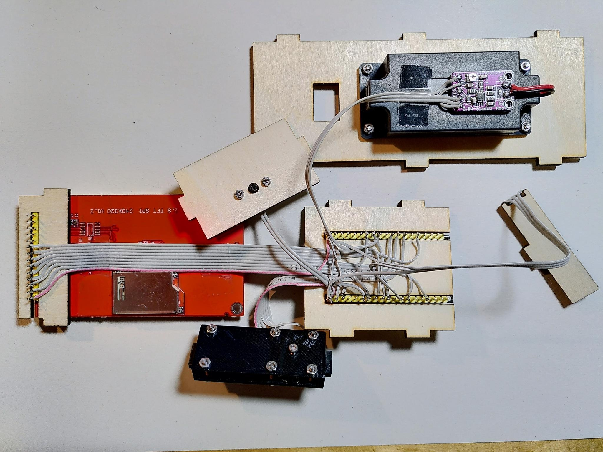
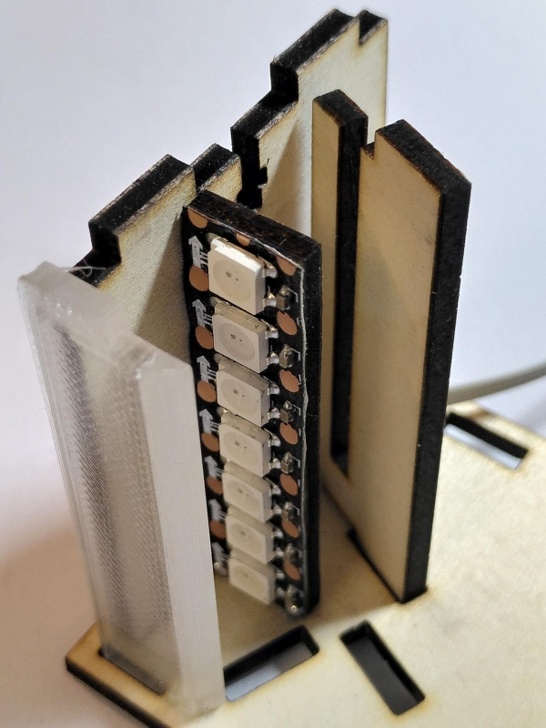
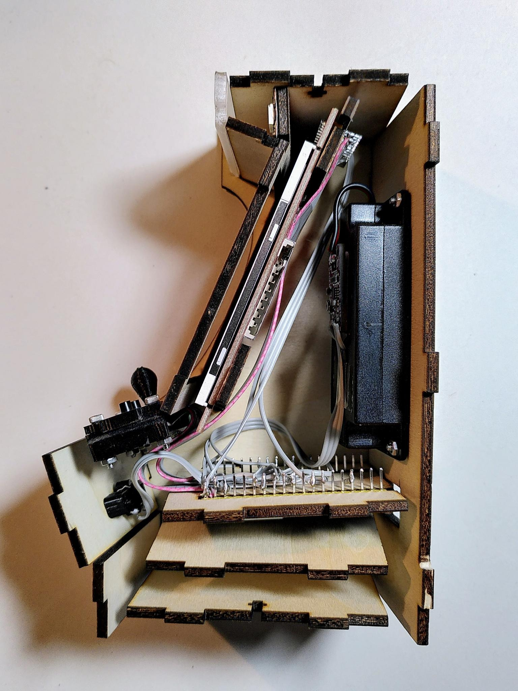

# Cabinet

The cabinet is built from 15 lasercut 3mm plywood parts and is designed to
house common off-the-shelf electronic components. The exact components are
listed below. 

* [38 pin ESP32 Devkit V4](https://www.espressif.com/en/products/devkits/esp32-devkitc)
* 2.8 inch 320x240 ILI9341 display
* [PAM8302A](https://www.adafruit.com/product/2130) amplifier
* cased 3W / 8 ohms speaker as seen in the photos below
* assembled [control board](../controlboard)
* [coin button](../coinbutton)
* four M2 x 8mm screws with matching nuts
* some wires, solder, ...

The cabinet may have to be modified If different parts are being used.

The cabinet consists of two main side sections and 13 parts to be
mounted between both sides. The electronic parts are either secured
between two wooden parts (the display between parts 1, 5 and 10 and
the ESP32 between parts 11 and 13) or screwed to a wooden part (the
speaker to part 12 and the coin button to part 6). The LED stripe
comes with adhesive tape and sticks to its wooden part 9.

The [transparent plasic part for the marquee](../marquee) as well as
the [control board](../controlboard) and the [coin
button](../coinbutton) are 3d printed and are either screwed to the
plywood parts 6 and 12 or use the same 3mm flanges and are inserted
into the side parts just like the other wooden parts are.

If no illuminated marquee is wanted, then the plywood part 2 is used
instead of the 3D printed transparent part and the LED stripe is not
attached to part 9.

Also available as [PDF](schema.pdf)

The following files can be used with most laser cutters. All parts fit
onto one single A4 sized piece of 3mm thick plywood.

Also available as [SVG](lasercut_parts.svg) and [PDF](lasercut_parts.pdf)

Once the electronics are [assembled and tested](../assembly) they are
mounted to their plywood parts.

The LEDs are attached to plywood part 9 and inserted into the top part
3. Once the top part is secured to one side using a M2*8mm screw part
9 attaches quite firmly to the top part 3. Its cable needs to go above
the display and plywood part 10.

All parts are assembled onto one of the two identical side parts. Afterwards the second side is mounted.

It's helpful to leave the rear part 12 open while attaching the second
side. That way the other parts inside can be reached from the rear and be moved to their exact positions until both sides attach firmly.

Once both sides are fully attached the rear part 12 can carefully be
inserted to finish the setup. During assembly the sides may be secured
using e.g. masking tape. Once they are done four M2 * 8mm screws and
four M2 nuts are used to secure the sides to parts 3 and 8.

Be careful not to drop the nuts into the assembled device. A piece of
tape placed at the inside of parts 3 and 8 may help keeping the nuts
from being lost during assembly.
