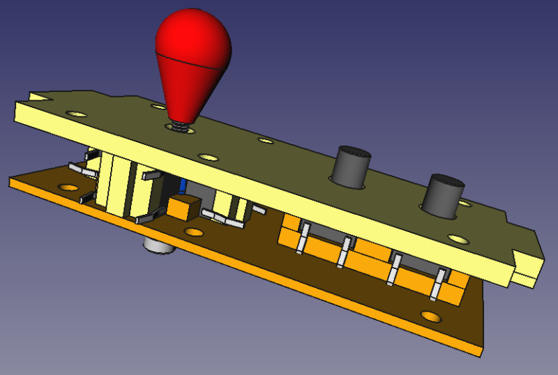
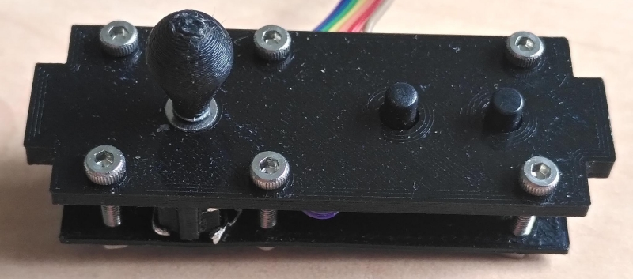

# Galagino Control Board

The control board is a simple joystick and button compartment for
use with galagino. It consists of four 3d printed parts.

Additionally needed:

- Six screws M2x12mm
- One screw M2x20mm
- Six M2 nuts
- Two M2 washer
- Four 6x6mm push buttons, through hole, height 4.3mm
- Two 6x6mm push buttons, through hole, height 9mm

The control boards surface is 50mm wide and thus matches the width
of a 2.8 inch TFT display. The control board has two 3x10mm flanges
to be used with a small laser cut cabinet.

