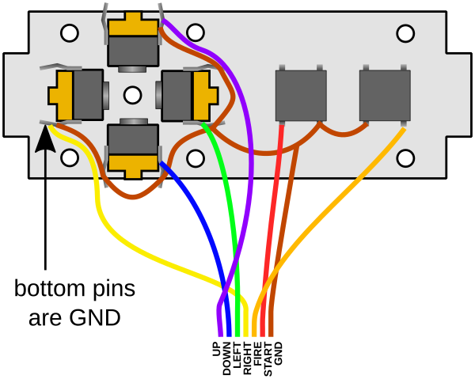
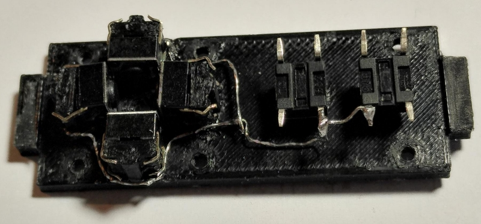
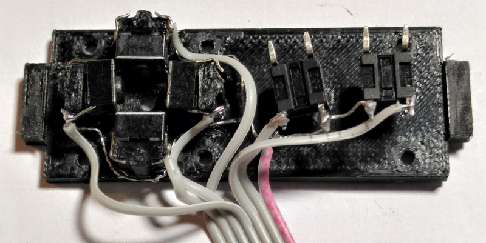

# Galagino Control Board

The control board is a simple joystick and button compartment for
use with galagino. It consists of four 3d printed parts.

Additionally needed:

- Six screws M2x12mm
- One screw M2x16mm
- Six M2 nuts
- Four M2 washers
- Four 6x6mm push buttons, through hole, height 4.3mm
- Two 6x6mm push buttons, through hole, height 9mm

The control boards surface is 50mm wide and thus matches the width
of a 2.8 inch TFT display. The control board has two 3x10mm flanges
to be used with a small laser cut cabinet.

## Wiring

The colors and order of the wires in the following schema matches the
colors and order of the wires in the [assembly instructions](../assembly).

The wiring of the controlboard is a little bit delicate. It starts
with a GND wire connecting one pin of each button. The wires may
protrude to the bottom as this will be inside the final cabinet. But
they must not protrude to the top as this will be the front face which
is convered by a plywood part which won't leave any space for cables.

Once all ground connections are done, a seven wire ribbon cable is
connected to all buttons and to the GND wire:

