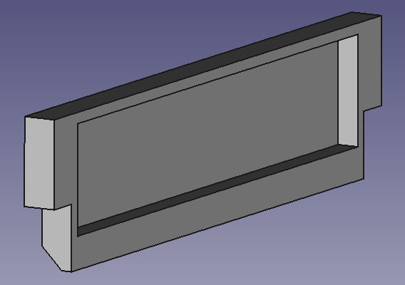
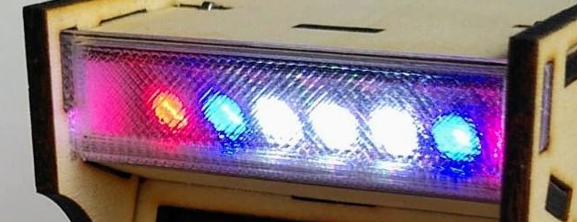

# Marquee

The marquee can optionally be equipped with seven WS2812B LEDs.
The [cabinet](../cabinet) part 2 made of plywood then needs to be
replaced by this transparent 3d printed replacement.

[FreeCAD](marquee.FCStd) [STL](marquee.stl)

This part is then mounted at the cabinets top front.

