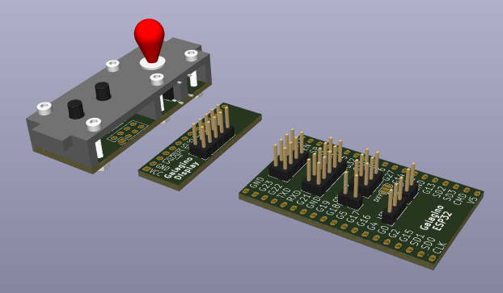
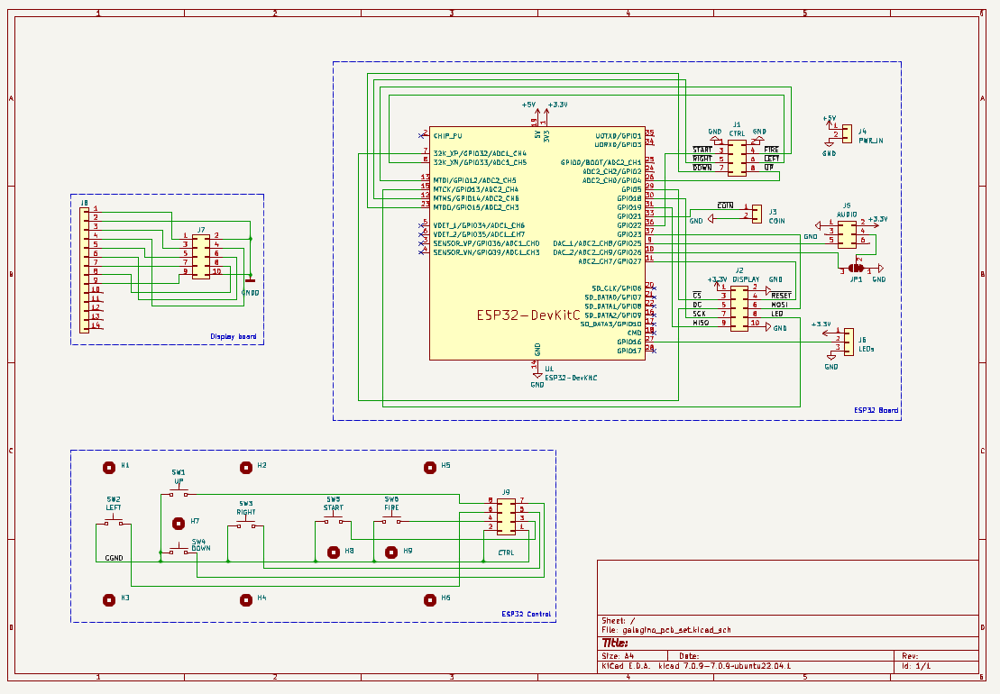
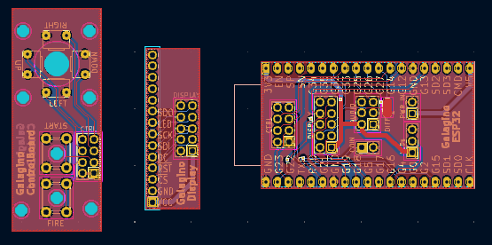

# Galagino PCB set

The Galagino PCB set is meant to make assembly much easier.
It consists of three PCBs. One is for the display, one for the
ESP32 and one for the joystick. 

The joystick comes with a freecad design for matching plastic parts
([controlboard_base.stl](controlboard_base.stl),
[controlboard_actuator.stl](controlboard_actuator.stl),
[controlboard_knob.stl](controlboard_knob.stl)) to go with the
PCB. The joystick uses standard through-hole buttons with the legs
bent 90 deg outwards to go through the PCB and the other legs being
cut.

[PDF](schematic.pdf)

